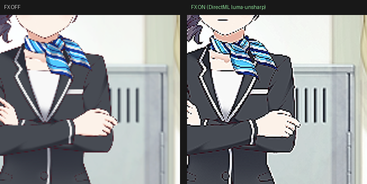
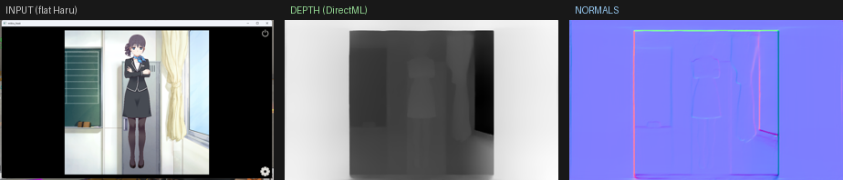
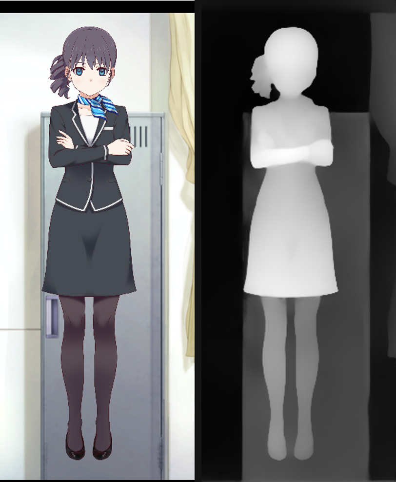

# live2d-directml-lab

**「D3D12 で動く Live2D に、DirectML のニューラル推論をパイプライン内（CPU 往復ゼロ）で混ぜると何が起きるか」を実験した記録（lab）。**
結論を先に言うと — **完成された Live2D イラストへの「後処理推論」は、媒体の性質と構造的に噛み合わずノイズになりやすい**、という知見に行き着きました。本リポジトリはその実験過程・技術・到達点を、成功も失敗も含めてまとめたものです。

> 前提：D3D12 への Live2D レンダラ移植は別リポジトリ [live2d-cubism-d3d12](https://github.com/mogmog-0110/live2d-cubism-d3d12)。本ラボは「その上で DirectML を使うと？」の実験で、**意図的に切り離して**います（移植は単体で資産価値があり、実験のノイズを混ぜないため）。

---

## 動機

公式非対応の D3D12 へ Live2D を移植できた。では「D3D12 だからできる、新しいキャラクター表現」は何か？ — その選択肢として **DirectML（GPU 推論をレンダリングパイプラインの一段として、CPU 往復なしで回す）** が入ってきました。「描いた絵を統計モデルで加工して、新しい見え方を作れないか」という発想です。

## 作ったもの（技術としては成立）

- **raw DirectML in-pipeline パス（zero readback）**
  `backbuffer → [compute: pack HWC→NCHW tensor] → [DirectML op] → [compute: unpack] → 合成 → backbuffer`。
  全て同一 D3D12 コマンドリスト上、**CPU 往復なし**。自前 DML グラフを差し替えるだけで効果を変えられる（`DX12NeuralFx.hpp`）。
- **ORT + DirectML EP の非同期統合**（重い学習済みモデル用）
  単眼深度モデル（Depth-Anything-V2-Small, ONNX）を **別スレッドで非同期ロード**（99MB ＋ DML グラフコンパイルで数十秒、render thread をブロックしない）し、フレーム境界で `readPixels` → 推論 → 深度テクスチャへ反映（`NeuralDepth.hpp` / `DX12NeuralRelight.hpp`）。

## 試した効果と、起きたこと

### ① シャープン（element-wise → 3×3 conv）
クリーンなセル塗りに**不向き**。アニメ絵は既に輪郭がパキッとしており、シャープンは線を過剰に立て＋ハローを足す＝品質を下げる方向にしか働かない。

→ チャンネル独立シャープン由来の**色フリンジ**は「輝度のみアンシャープ」で消せた（左=OFF / 右=ON、色の縁取りなし）が、それでも「完成品を弄っている」感は残った。

### ② ニューラル・リライティング（平面 → 推定法線 → 動的光源）
「DirectML で立体形状を推論し、フラットな絵を動的にライティングする」— 一番筋が良さそうな案。**加算のみ**（元の絵は一切暗くせず光を足すだけ、強度0で素の絵に一致）に設計し、劣化ゼロを担保した。

ここで**重要な技術的発見**:

写真学習の単眼深度を**全画面**にかけると「部屋の奥行き」を拾い、**キャラは平面のまま**（=フラットな絵には復元すべき立体が無い）。

しかし**キャラに密着クロップ**すると別物に — 人物が前景として浮き、**胴体が手前・シルエット端へ落ちる「体の丸み」**が推論される。「クロップ → 深度 → 形状 → 加算光」で形に沿った光が出せる。

## 到達した結論（lab の価値）

実機で見た率直な印象は「**ちょっとよくわからない**」でした。そして、なぜそうなるかは構造的だと考えています:

> **Live2D は「デザイナーが完成させた、意図のある絵」を動かす技術。** 一枚のピクセルが作家の判断。そこに**後処理の推論**を被せるのは、作家が置いていないピクセルを統計的推測で上書きする行為で、チューニングで消える話ではなく **intentionality と噛み合わない**。だから「ノイズ」に感じる。

切り分けると、相性が悪いのは「推論 × キャラ表現」全体ではなく **「推論 × “完成ピクセルの後処理”」**。推論が**ピクセルに触れずリグ（パラメータ）を駆動する側**に回れば、絵は汚れず「作家の絵がそのまま生きて反応する」方向に効く（音声→リップシンク等）。— ただしそれは既存技術。本当に新しい領域（2D→3D 化・生成的表情）は研究級の重さ。

**「手の届く neural × Live2D は、後処理＝ノイズ か、リグ駆動＝既存 のどちらかに寄る」** — これが、実際に作って得た評価です。

## 技術として残るもの（効果の当たり外れと独立）

- CPU 往復ゼロの **DirectML in-pipeline 推論パス**
- **非同期 ORT 深度のパイプライン統合**
- **クロップ → 深度で “平面絵から立体形状” を引き出す**知見
- ハマりどころ：エンジン同梱 ORT は 1.24 なのに `onnxruntime.dll` が exe 隣に deploy されておらず、Windows が `system32` の 1.17.1（Windows ML 同梱）を掴む → API 不一致で**捕捉不能な SEH クラッシュ**。exe 隣へ正しい DLL を deploy して解決。

## ソース

| ファイル | 内容 |
|---|---|
| [`src/DX12NeuralFx.hpp`](src/DX12NeuralFx.hpp) | raw DirectML in-pipeline（pack/op/unpack/blit、zero readback） |
| [`src/NeuralDepth.hpp`](src/NeuralDepth.hpp) | ORT+DML 単眼深度（非同期ロード、ImageNet 前処理、クロップ） |
| [`src/DX12NeuralRelight.hpp`](src/DX12NeuralRelight.hpp) | 加算リライト（深度→法線→動的光源、輝度フォールバック） |

## ライセンス

コード：MIT。Cubism SDK / モデル素材・Depth-Anything モデルは各自取得（非同梱）。
